# An Application for Algorithmic Textual Comparison


## Running the Project

The project is bundled and packaged as containers. These are required to run the project:

- [Docker installation](https://docs.docker.com/engine/install/)
- A Terminal:
    - Windows: Use one of these: [Windows Terminal](https://aka.ms/terminal), PowerShell, CMD
    - Linux: Anyone using Linux knows where it is.
    - MacOS: Press Command+Space, then type Terminal.
- Internet connection: To download pre-built images.

### Initial One-time Steps
A persistent volume for database data must be created once:

```shell
docker volume create idp-postgres-data
```

This volume is stored on your local device.

### Running The Project

```shell
docker-compose up -d
```

Note that the project runs in your background. It needs to be stopped to free up system resources.

```
docker-compose down
```

## Getting More, Going Advanced

### Use of local builds instead of pre-built versions
We use `docker-compose` to build multiple containers and ensure inter-connectivity among them. For better performance, we have pre-built several packages. To use your own built images, go to [docker-compose.yml](docker-compose.yml) file, comment out lines starting with `image: ghcr.io...`, then uncomment their following lines.

After doing this, you can build and run:

```shell
docker-compose up -d --build
```

### Deleting all local data

```shell
docker-compose down
docker volume rm idp-postgres-data
```

### CUDA enabled builds

Nvidia's CUDA library enables GPU acceleration. `torch` dependency of the backend can be installed with CUDA packages as well. In this case, the build size will be much larger, possibly around 12 GB for the backend. Follow the following steps:

1. First, go to [backend/pyproject.toml](backend/pyproject.toml) file and find lines starting with `torch`.
2. Comment out CUDA-enabled line, whereas comment in the current one.
3. Run the following on terminal:

```shell
poetry lock
```

4. Build the `backend` image:

```shell
docker build -t tum_idp_backend:latest --platform linux/amd64 --no-cache .
```

5. Update [docker-compose.yml](docker-compose.yml) file by referring local builds subsection of this document.

6. Run it.

## UI Screenshots

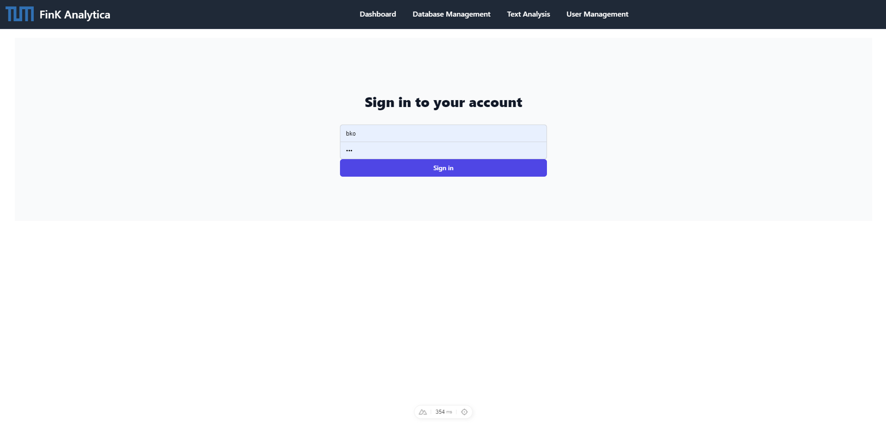
Figure: Sign In Page

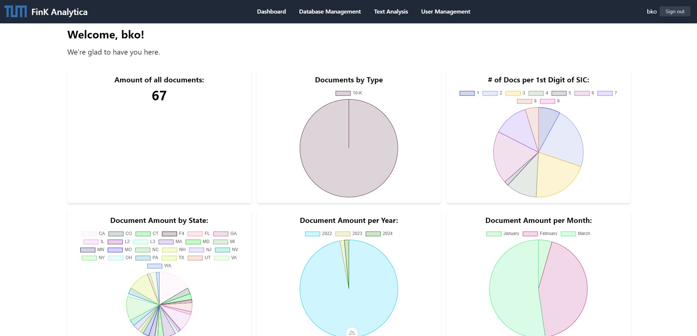
Figure: Dashboard

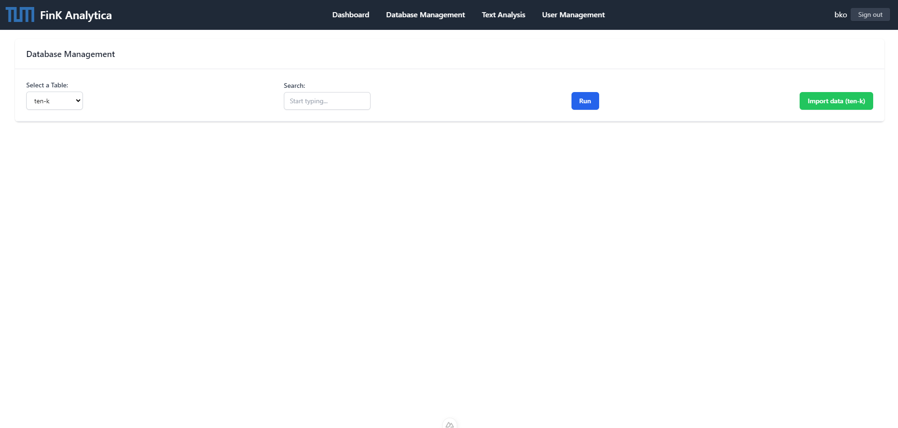
Figure: Database Management Tab before Query

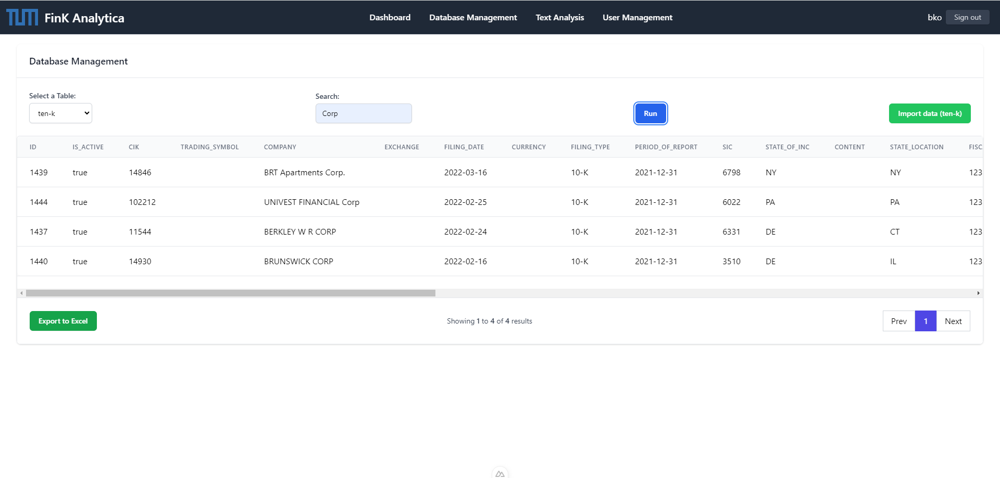
Figure: Database Management Tab with Query Search

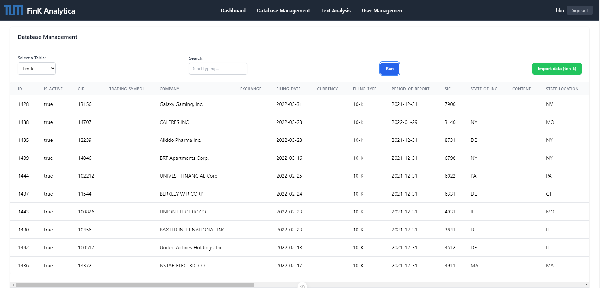
Figure: Database Management Tab with No-Query Search

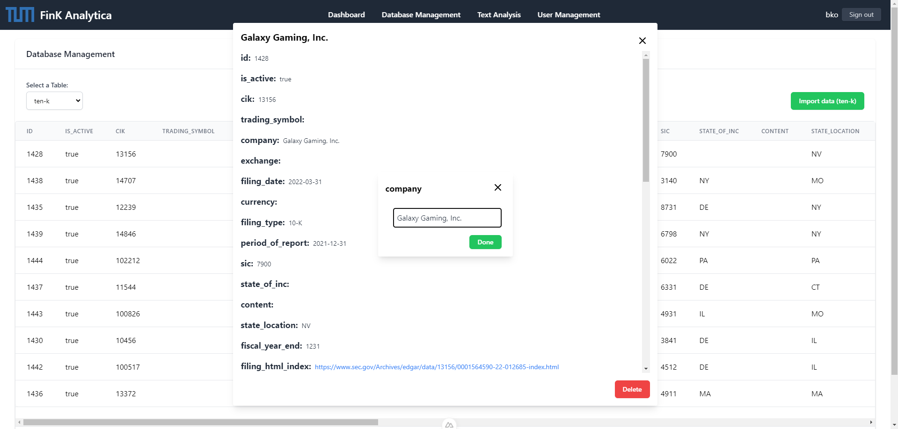
Figure: Editing Item in Database Management Tab

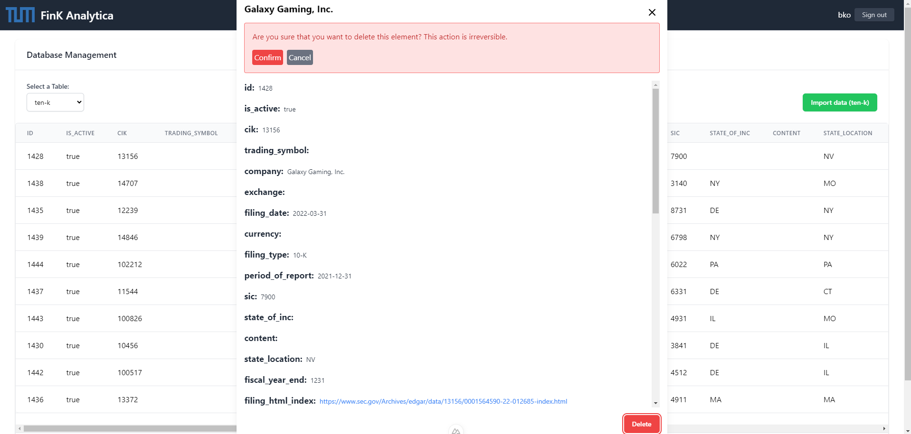
Figure: Deleting Item in Database Management Tab

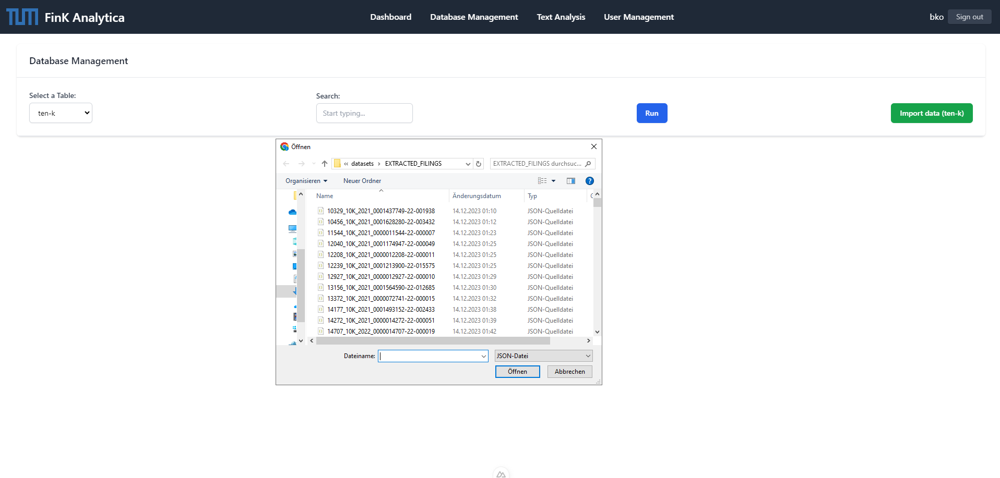
Figure: Importing Data in Database Management Tab

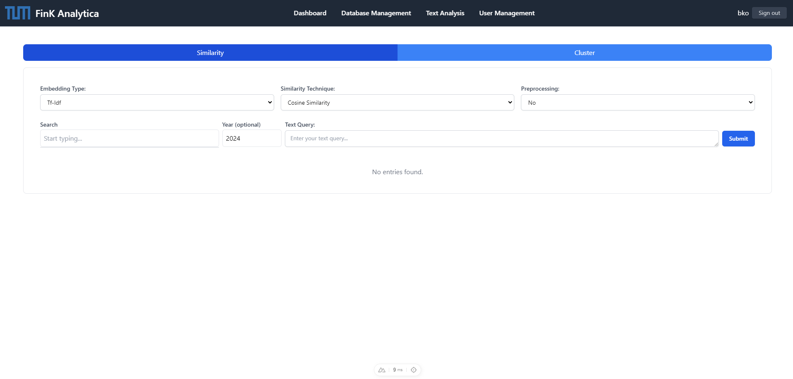
Figure: Similarity with no Result

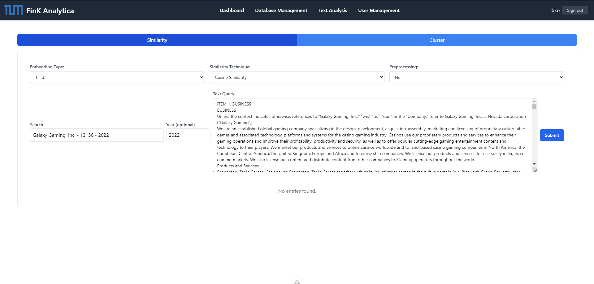
Figure: Text Query for Similarity Tab

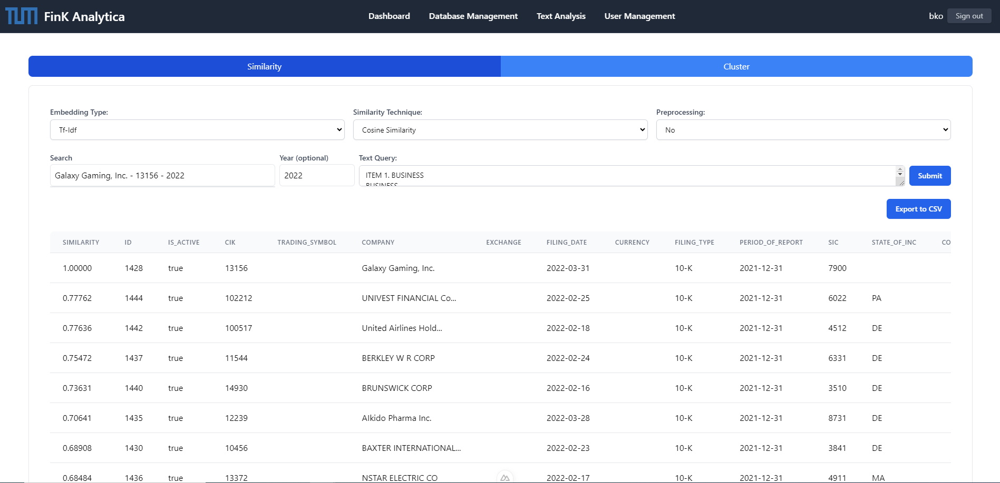
Figure: Similarity Results

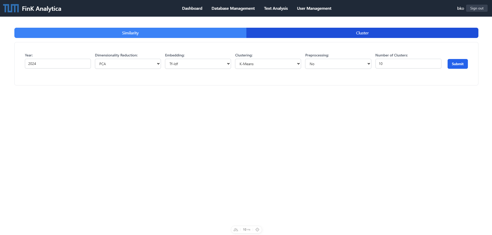
Figure: Clustering before Graph Generated

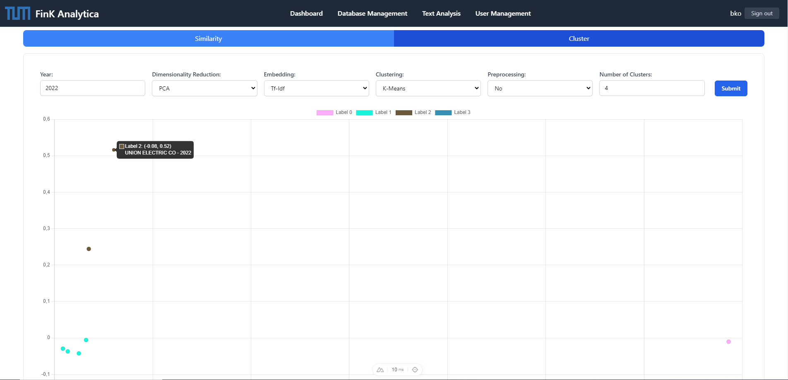
Figure: Clustering Graph with Data

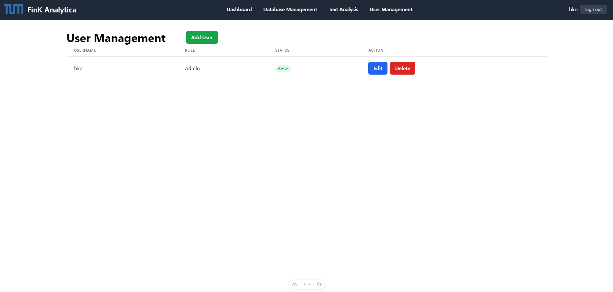
Figure: User Management without User

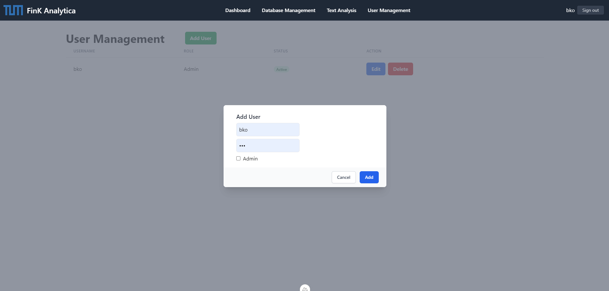
Figure: Add User Dialog in User Management Tab

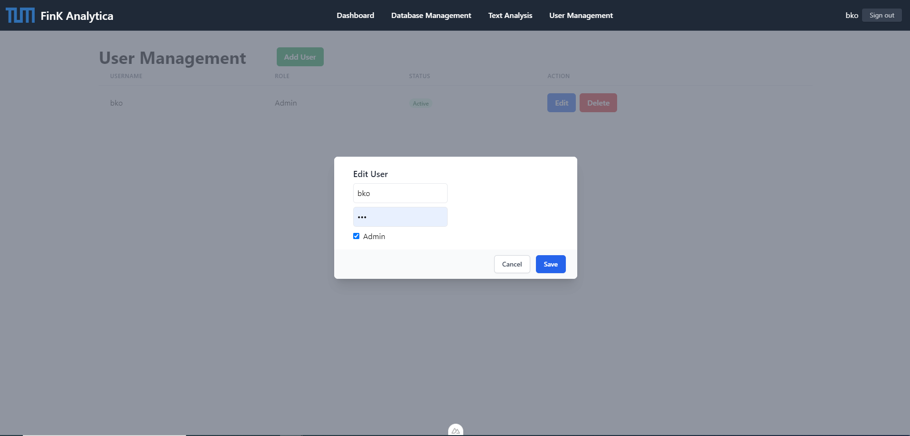
Figure: Edit User Dialog in User Management Tab

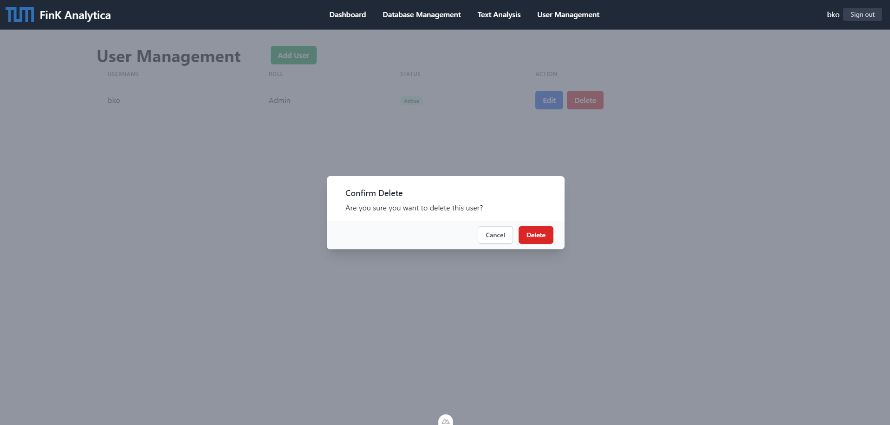
Figure: Delete User Dialog in User Management Tab
